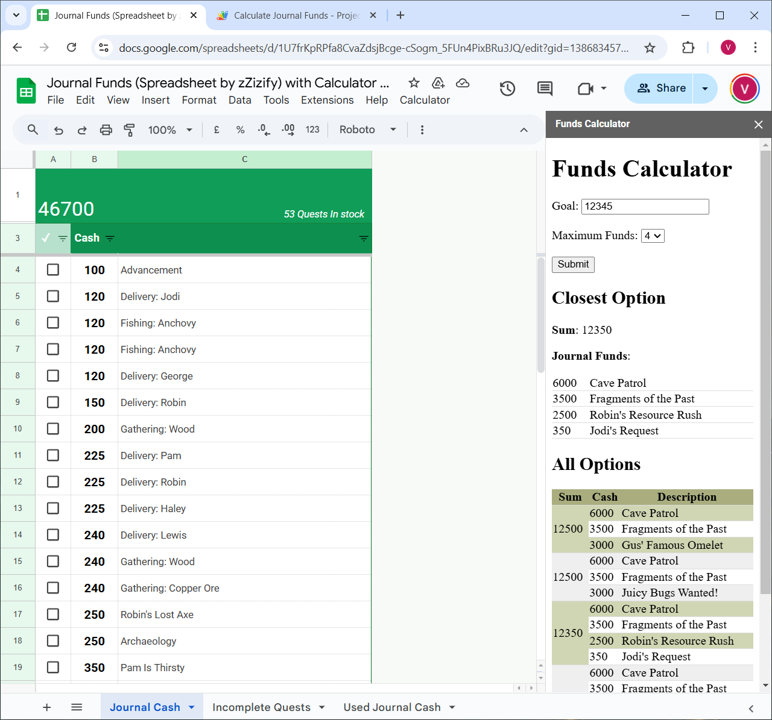
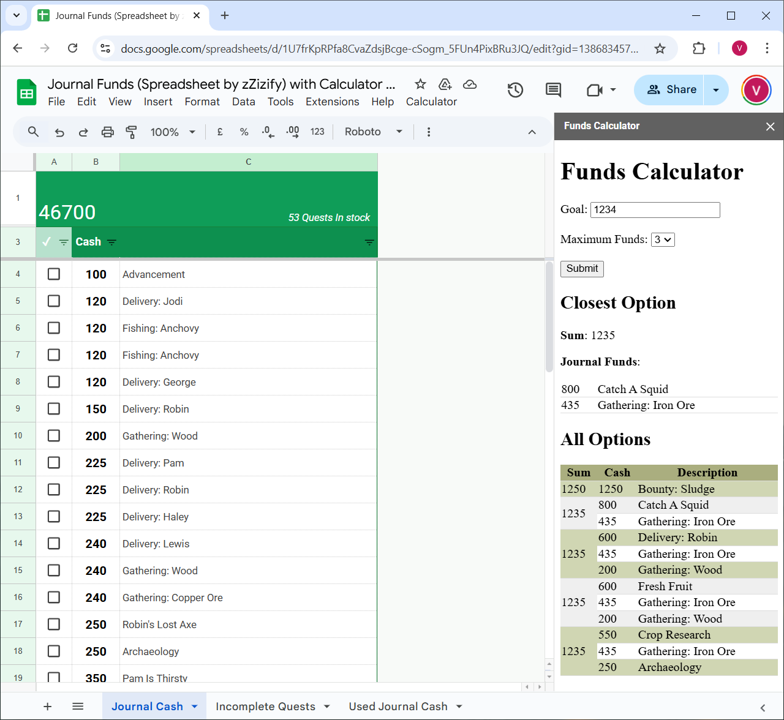

# stardew-journal-funds-calculator
A Google Sheets calculator sidebar to help determine which journal funds to use to get the amount desired

## Included Files:
This repo contains the following Apps Scrips, saved in the Scripts subfolder:
* **SetUp.gs:** A text file containing the Apps Script code which sets up the menu item in Google Sheets, has the function to open the sidebar, and reads in all of the Journal funds as a list and sorts it. Open this file with a text editor and copy-paste the contents into a new "Script" file.

* **Calculations.gs:** A text file containing the Apps Sctipt code which calculates the combination of funds to reach the final desired amount. Open this file with a text editor and copy-paste the contents into a new "Script" file.
  * This file includes a recursive function which acts the same as n number of nested for loops.
    * This algorithm was found on [Stack Overflow](https://stackoverflow.com/a/73186256) and tailored with the help of Claude.ai
  * The algorithm used to calculate the combination is a brute force method which adds together all options smaller than the desired amount. It will return the smallest of these results which is larger than the desired amount.
  * Google Sheets is not powerful enough to utilise this algorithm to calculate more than a combination of 4 items at a time before experiencing a stack overflow. In some cases, it can only calculate 2 items at a time.

* **PopulateSidebar.gs:** A text file containing the Apps Script code that iterates over the desired number of answers and returns the HTML needed to display the results. Open this file with a text editor and copy-paste the contents into a new "Script" file.

* **calcPage.html:** A text file containing the HTML code for the display. In your Apps Script Project, create a new HTML file and copy the contents of this text file into it.
  * This is the html that styles the sidebar in Google Sheets. It has a text box for entering the monetary goal and a drop down list for the maximum number of journal funds used to calculate. It will show the best result which is the result which is closest to the desired goal. It will also show some of the other options calculated.

 

## Usage Instructions:
* Create a copy of [this Google Sheet](https://docs.google.com/spreadsheets/d/16qmgEYAUB3Iyhj1IUuL9avZPrBY1U1wXO_LtjXsbzCo/edit?usp=sharing) created by zZizify
* Copy in the files above as per the directions
* Save and return to the spreadsheet. In the menu bar you should see a Calculator option. Run this and accept security risks. Now you can start using this calculator.

## Display:

